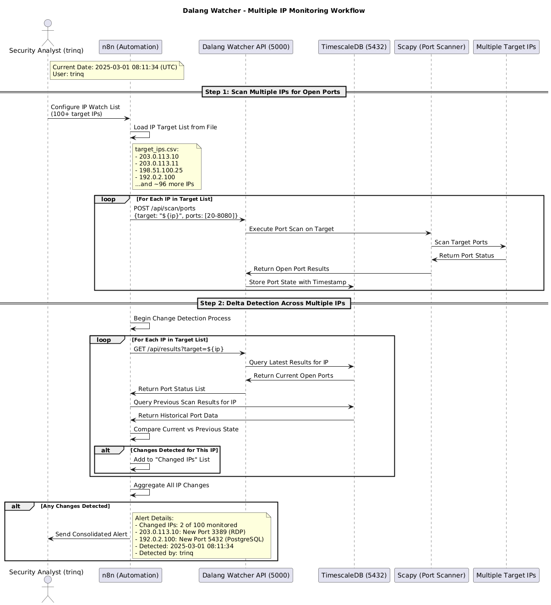

# Dalang Watcher

**Date: 2025-03-01**  
**Author: trinq**

## Overview

The Dalang Watcher is a comprehensive solution for monitoring, scanning, and managing the attack surface of network environments. It leverages Python's Scapy library for network reconnaissance, n8n workflow automation for orchestration, and TimescaleDB (PostgreSQL) for time-series data storage and analysis.

This project enables security teams to continuously discover, enumerate, and monitor network assets and services, detecting changes in the organization's attack surface over time.

## Features

- **Network Port Scanning**: Multiple port scanning techniques
  - Stealth SYN scans
  - Full TCP connect scans
  - UDP port scans
- **Host Discovery**: ARP-based host discovery on local networks
- **Automated Workflows**: n8n-based workflows for:
  - Scheduled scans
  - Change detection
  - Alerting
- **Temporal Analysis**: TimescaleDB integration for time-series data analysis
- **API-First Design**: RESTful API for integration with other systems
- **Containerized Deployment**: Easy setup with Docker and Docker Compose

## Documentation

- [Quick Start Guide](docs/QUICKSTART.md) - Get up and running quickly
- [API Documentation](docs/api/README.md) - Detailed API reference
  - [Port Scanning](docs/api/endpoints/scan_ports.md)
  - [Host Discovery](docs/api/endpoints/scan_hosts.md)
  - [Results Retrieval](docs/api/endpoints/results.md)
  - [Scans Information](docs/api/endpoints/scans.md)

## Architecture

The Dalang Watcher system consists of three main components:

1. **Dalang Watcher API Service**: Python Flask application exposing REST endpoints that leverage Scapy for network scanning
2. **TimescaleDB**: PostgreSQL with TimescaleDB extension for efficient storage of time-series scan data
3. **n8n**: Workflow automation tool for scheduling scans and processing results

```
+--------+           +-----------+           +-------------+
|  n8n   |---HTTP--->|  Dalang   |---SQL---->| TimescaleDB |
| (5678) |<--HTTP----| Watcher API|<--SQL-----| (5432)      |
+--------+           | Service   |           +-------------+
                     |  (5000)   |
                     +-----------+
                           |
                           | Scapy
                           v
                     Network Assets
```

### Sequence Diagram - Multiple IP Monitoring Workflow

The following sequence diagram illustrates how Dalang Watcher monitors multiple IP addresses and detects changes:



> The PlantUML source code for this diagram is available in the `sequence_diagram.puml` file.

## Requirements

- Docker and Docker Compose
- Network permissions for scanning (requires NET_RAW and NET_ADMIN capabilities)
- A host with access to the networks you want to scan

## Installation & Setup

### 1. Clone the repository

```bash
git clone https://github.com/trinq/dalang-watcher.git
cd dalang-watcher
```

### 2. Configure environment variables (Optional)

Edit the `.env` file to customize your setup:

```bash
# Use nano, vim or your favorite text editor
nano .env
```

### 3. Start the system

```bash
docker-compose up -d
```

### 4. Verify the services are running

```bash
docker-compose ps
```

You should see three services running:
- `timescaledb`: The TimescaleDB database
- `dalang_watcher_api`: The Dalang Watcher API service
- `n8n`: The n8n workflow automation service

### 5. Import n8n workflows

1. Open the n8n dashboard at http://localhost:5678
2. Go to Workflows > Import from File
3. Import the workflow JSON files from the `n8n-workflows` directory

## Usage

### Basic Port Scan

To perform a port scan using the API directly:

```bash
curl -X POST http://localhost:5000/api/scan/ports \
  -H "Content-Type: application/json" \
  -d '{
    "target": "192.168.1.1",
    "ports": [22, 80, 443, 3306, 8080],
    "scan_type": "stealth",
    "timeout": 2
  }'
```

### Host Discovery

To discover active hosts on a network:

```bash
curl -X POST http://localhost:5000/api/scan/hosts \
  -H "Content-Type: application/json" \
  -d '{
    "network": "192.168.1.0/24"
  }'
```

### Retrieving Results

To get the results of a specific scan:

```bash
curl "http://localhost:5000/api/results?scan_id=1"
```

Or to get all results for a specific target:

```bash
curl "http://localhost:5000/api/results?target=192.168.1.1"
```

### Automating with n8n

Two example workflows are provided:

1. **Scheduled Port Scan**: Runs a port scan at regular intervals
2. **Port Change Monitor**: Detects changes in open ports and sends alerts

To customize these workflows:
1. Open n8n at http://localhost:5678
2. Navigate to the workflow
3. Edit the nodes to adjust targets, scan parameters, and notification settings

## API Endpoints

### Port Scanning

**Endpoint**: `POST /api/scan/ports`

**Parameters**:
- `target` (string): Target IP address
- `ports` (array): List of ports to scan
- `scan_type` (string): Type of scan (`stealth`, `connect`, or `udp`)
- `timeout` (number): Timeout in seconds for each port

**Response**:
```json
{
  "message": "Scan started",
  "scan_id": 1,
  "timestamp": "2025-03-01T07:09:09.123456"
}
```

### Host Discovery

**Endpoint**: `POST /api/scan/hosts`

**Parameters**:
- `network` (string): Network in CIDR notation (e.g. "192.168.1.0/24")

**Response**:
```json
{
  "message": "Host scan started",
  "scan_id": 2,
  "timestamp": "2025-03-01T07:09:09.123456"
}
```

### Get Results

**Endpoint**: `GET /api/results`

**Query Parameters**:
- `scan_id` (number, optional): Filter by scan ID
- `target` (string, optional): Filter by target IP

**Response**:
```json
[
  {
    "result_id": 1,
    "scan_id": 1,
    "target": "192.168.1.1",
    "port": 80,
    "protocol": "TCP",
    "status": "Open",
    "additional_data": null,
    "discovered_at": "2025-03-01T07:09:09.123456"
  }
]
```

### Get Scans

**Endpoint**: `GET /api/scans`

**Query Parameters**:
- `limit` (number, optional): Limit the number of results (default: 100)

**Response**:
```json
[
  {
    "scan_id": 1,
    "scan_type": "port_scan_stealth",
    "target": "192.168.1.1",
    "parameters": {"ports": [22, 80, 443], "timeout": 2},
    "created_at": "2025-03-01T07:09:09.123456"
  }
]
```

## Database Schema

The system uses two main tables in TimescaleDB:

### 1. `scans` Table

Stores metadata about each scan:

| Column      | Type      | Description                 |
|-------------|------------|----------------------------|
| scan_id     | SERIAL     | Primary key                |
| scan_type   | VARCHAR(50)| Type of scan performed     |
| target      | TEXT       | Target IP or network       |
| parameters  | JSONB      | Scan parameters            |
| created_at  | TIMESTAMP  | When the scan was initiated|

### 2. `scan_results` Table

Stores the actual findings (converted to a TimescaleDB hypertable):

| Column         | Type       | Description                    |
|----------------|------------|--------------------------------|
| result_id      | SERIAL     | Primary key                    |
| scan_id        | INTEGER    | Foreign key to scans.scan_id   |
| target         | TEXT       | Target IP address              |
| port           | INTEGER    | Port number                    |
| protocol       | VARCHAR(10)| Protocol (TCP, UDP)            |
| status         | VARCHAR(20)| Port status                    |
| additional_data| JSONB      | Additional information         |
| discovered_at  | TIMESTAMP  | When the result was discovered |

## Directory Structure

```
dalang-watcher/
│
├── api/                # Python API service
│   ├── app.py          # Main Flask application
│   ├── modules/        # Functional modules
│   │   ├── __init__.py
│   │   ├── scanner.py  # Scanning functionality
│   │   └── db.py       # Database operations
│   └── requirements.txt
│
├── docker/             # Docker configurations
│   ├── api.dockerfile  # Dockerfile for the API service
│   └── .dockerignore
│
├── db/                 # Database migrations and schema
│   └── init.sql        # Initial schema creation
│
├── n8n-workflows/      # n8n workflow definitions
│   ├── scheduled_port_scan.json
│   └── port_change_monitor.json
│
├── docker-compose.yml  # Main docker-compose file
├── .env                # Environment variables
└── README.md           # This file
```

## Security Considerations

- **Network Scanning**: Port scanning may be considered hostile activity in some environments. Always obtain permission before scanning networks you don't own.
- **Privileged Access**: Scapy requires raw socket access, which needs privileged permissions (root/admin).
- **Database Security**: The default configuration uses a simple password. For production, use strong passwords and consider additional security measures.
- **Network Segmentation**: Consider running the Dalang Watcher system in a dedicated security monitoring network segment.

## Troubleshooting

### API Service Not Working

1. Check if the container is running: `docker ps | grep dalang_watcher_api`
2. View logs: `docker logs dalang_watcher_api`
3. Ensure the container has proper network permissions: `docker-compose up -d --force-recreate dalang_watcher_api`

### Database Issues

1. Check the database container status: `docker ps | grep timescaledb`
2. View database logs: `docker logs timescaledb`
3. Connect directly to database: `docker exec -it timescaledb psql -U postgres -d dalang_watcher`

### n8n Problems

1. Check if n8n is running: `docker ps | grep n8n`
2. View n8n logs: `docker logs n8n`
3. Restart the service: `docker-compose restart n8n`

## License

This project is licensed under the MIT License - see the LICENSE file for details.

## Contributing

Contributions are welcome! Please feel free to submit a Pull Request.

---

Created by trinq - Updated on 2025-03-01